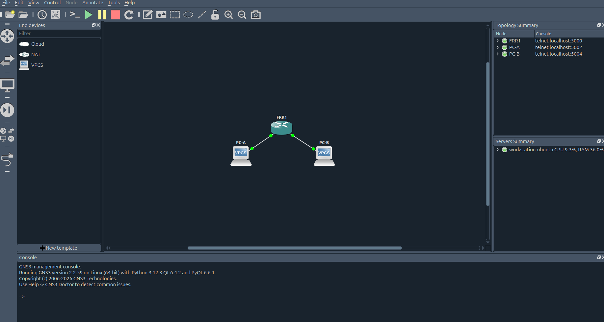
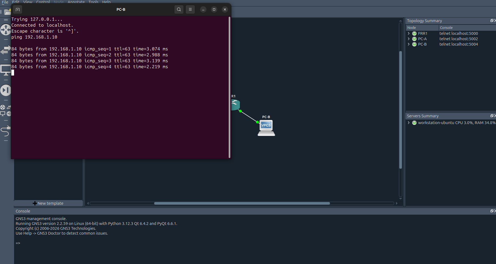

# Phase 1 - GNS3 topology with FRR and OSPF

## Nodes

| Node  | Type | IP address      | Role        |
|-------|------|-----------------|-------------|
| FRR-1 | FRR  | 192.168.1.1/24  | Router eth0 |
| FRR-1 | FRR  | 192.168.2.1/24  | Router eth1 |
| PC-A  | VPCS | 192.168.1.10/24 | Host LAN A  |
| PC-B  | VPCS | 192.168.2.10/24 | Host LAN B  |

## Topology

## Routing protocol

OSPF area 0 on both networks.

FRR router configuration: [frr-router.conf](../gns3/configs/frr-router.conf)

## Connectivity test

Ping from PC-A to PC-B: 

Ping from PC-B to PC-A:

