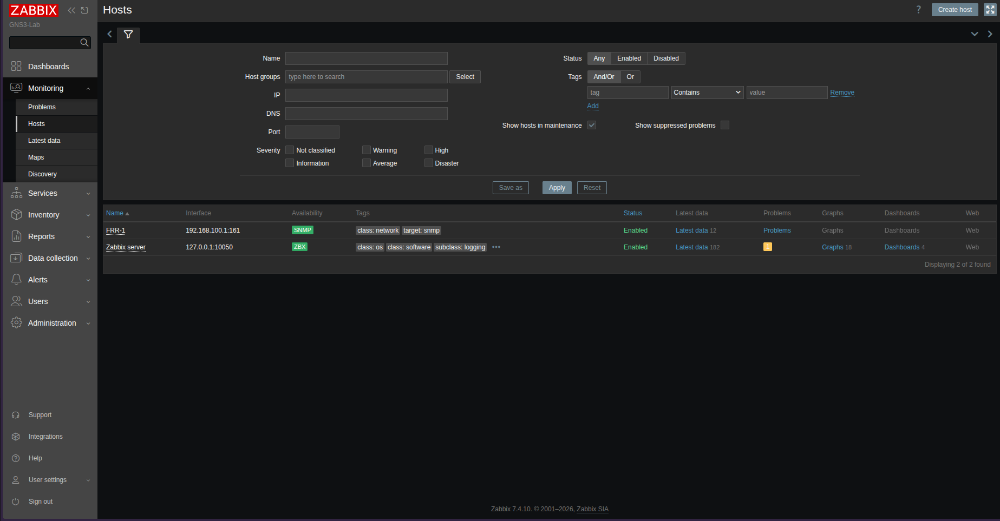
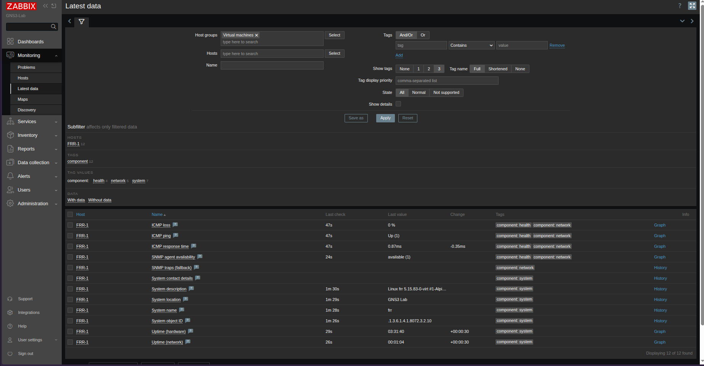
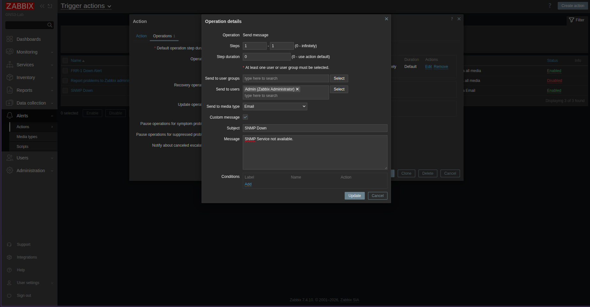
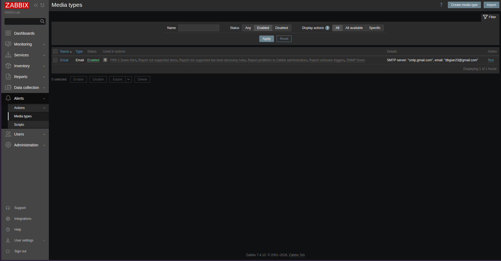
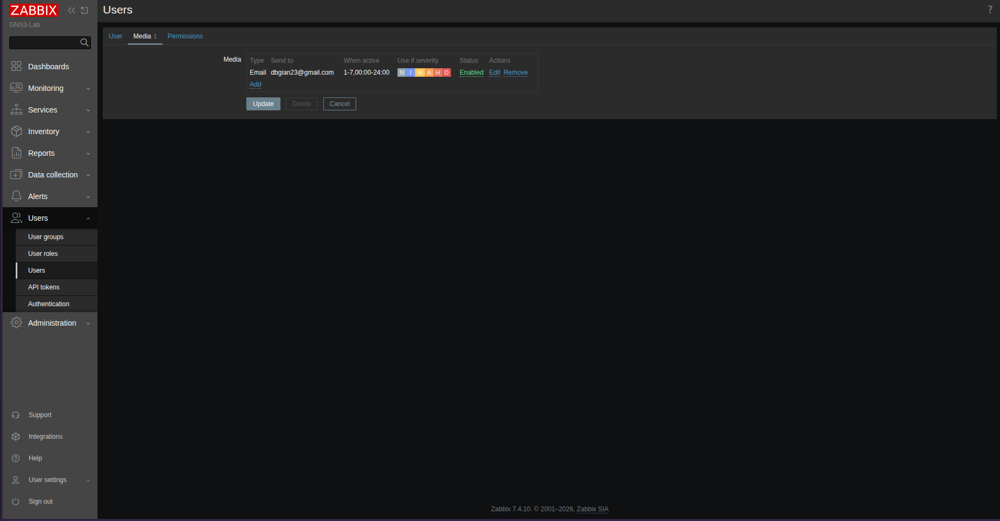
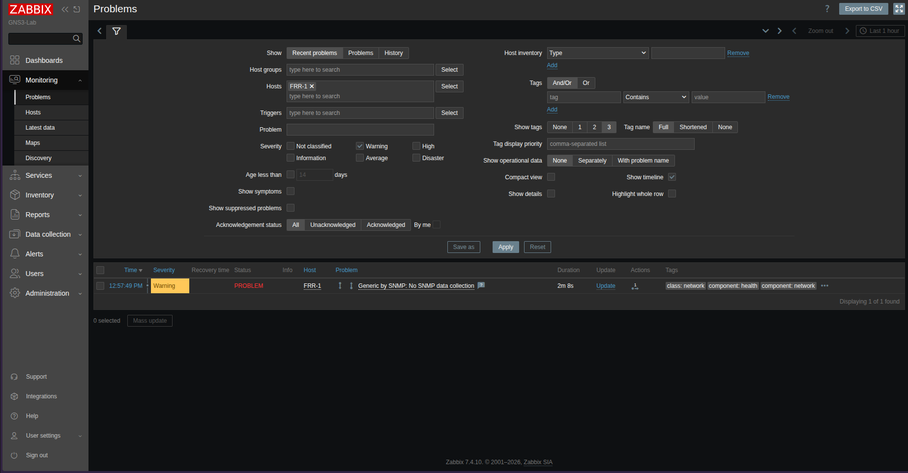
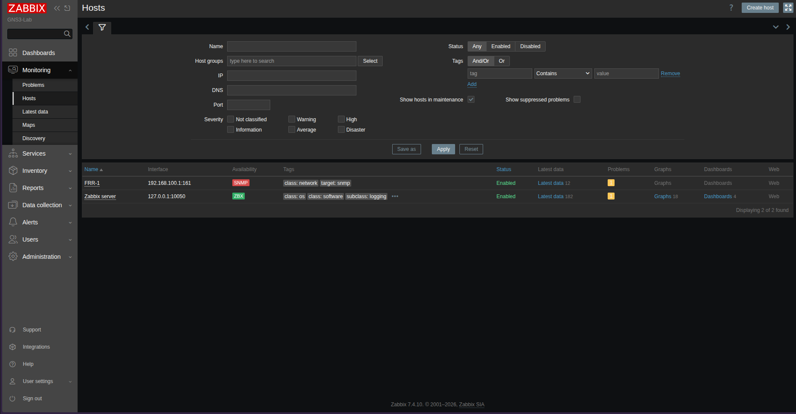
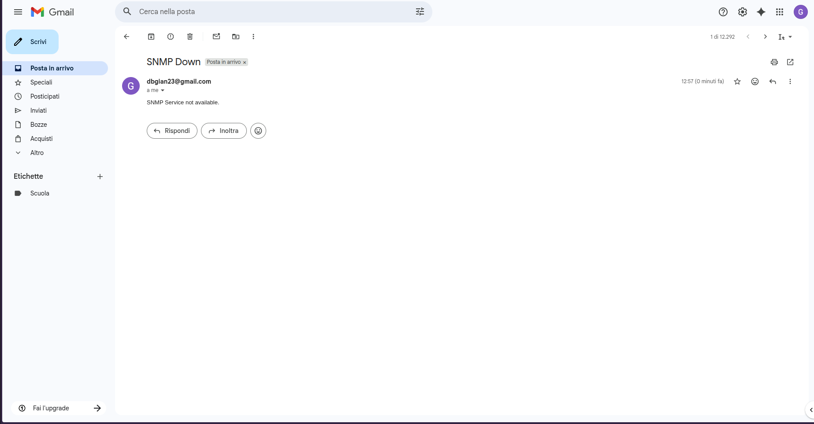
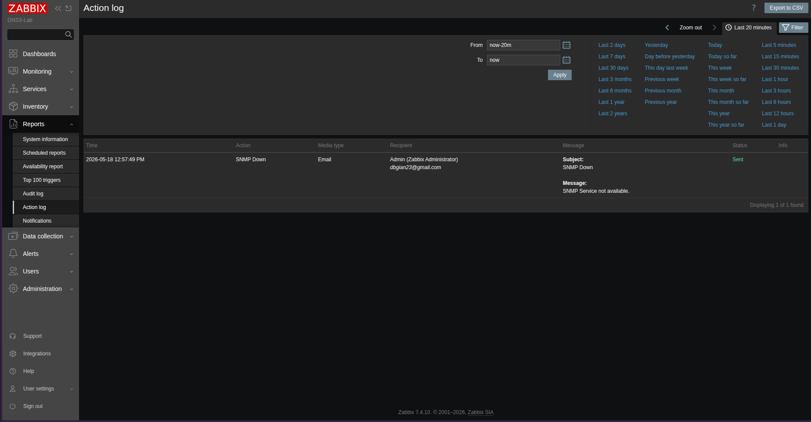
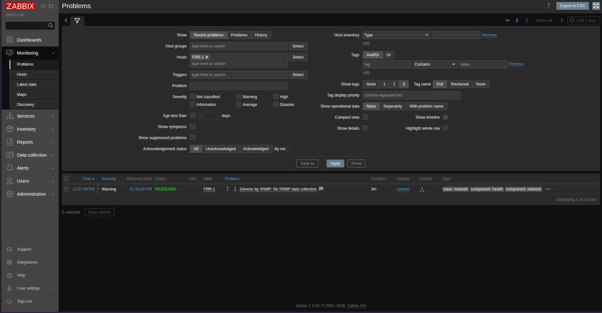

# Phase 2 - Monitoring with Zabbix and SNMP

## Overview

In this phase we installed and configured Zabbix on the Ubuntu host to monitor
the FRR-1 router running inside GNS3. FRR-1 was configured with net-snmp
to enable SNMP monitoring.

Zabbix monitors FRR-1 via both ICMP and SNMP, and sends email alerts via Gmail
when the SNMP service becomes unavailable.

## Zabbix installation

Installed on Ubuntu 24.04 using the official Zabbix 7.0 repository.

Components installed:
- zabbix-server
- zabbix-frontend
- zabbix-agent

Database: MySQL with dedicated zabbix user and database.

Web server: apache

Installation guide can be found at: https://www.zabbix.com/download?zabbix=7.4&os_distribution=ubuntu&os_version=26.04&components=server_frontend_agent&db=mysql&ws=apache

Web interface available at: http://127.0.0.1/zabbix

## Host monitoring

FRR-1 added to Zabbix with:
- Interface: SNMP v2c, community public, IP 192.168.100.1 port 161
- Template: Generic SNMP
- Host group: Network Devices
- Macro: {$SNMP.TIMEOUT} = 1m

### Hosts overview

### Latest data collected from FRR-1

Metrics collected via SNMP and ICMP:
- ICMP ping and response time
- SNMP agent availability
- System description, name, location
- Hardware and network uptime

## Alert configuration

### Trigger action

Created a trigger action named "SNMP Down" to notify when
FRR-1 SNMP becomes unavailable.

- Condition: trigger equals "Generic by SNMP: Unavailable"
- Operation: send email to Admin via Gmail
- Custom subject: SNMP Down
- Custom message: SNMP Service not available.

### Media type

Email notifications configured using Gmail with app password authentication.

### User email

Admin user configured with Gmail address to receive alerts.

## Incident simulation

To simulate a NOC incident, snmpd was stopped on FRR-1:

### Problem detected

Zabbix detected the SNMP outage within 1 minute and flagged it as a Warning.

### Hosts in warning state

Screenshot of the Hosts page during the incident showing FRR-1 in warning state.

### Email alert received

Gmail received the alert email with subject "SNMP Down".

### Action log

Zabbix action log confirms the email was sent successfully to the Admin user.

### Problem resolved

After restarting snmpd on FRR-1, Zabbix automatically marked the problem
as RESOLVED.

