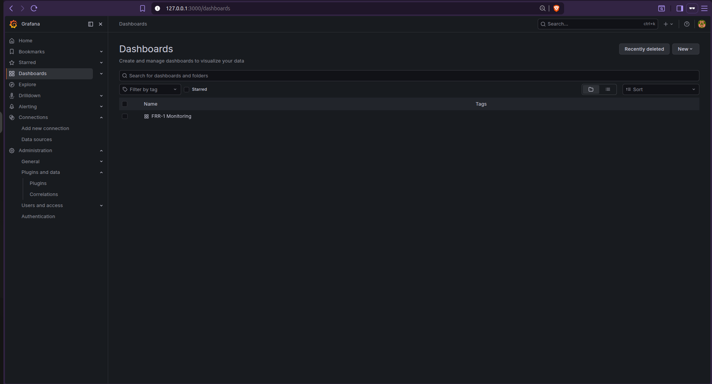
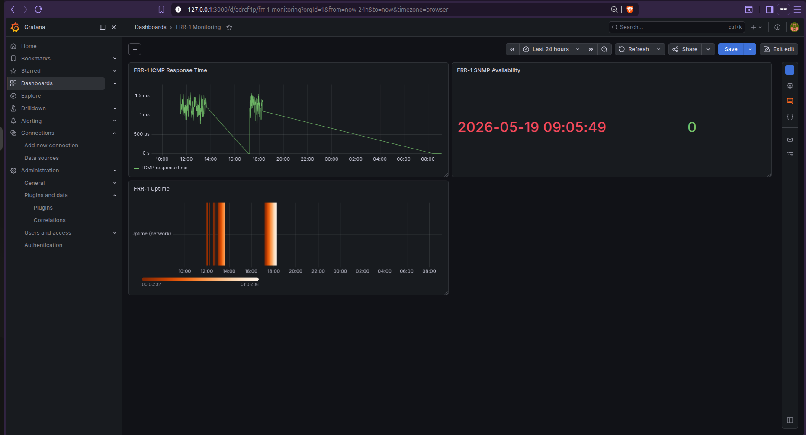
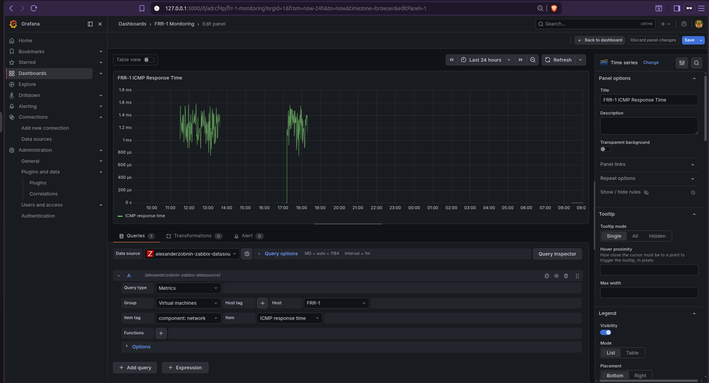
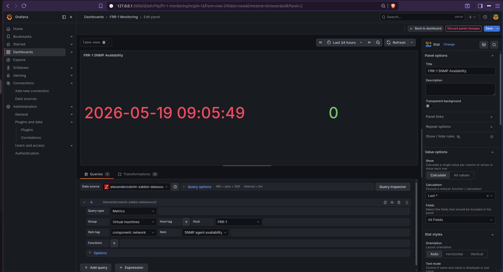
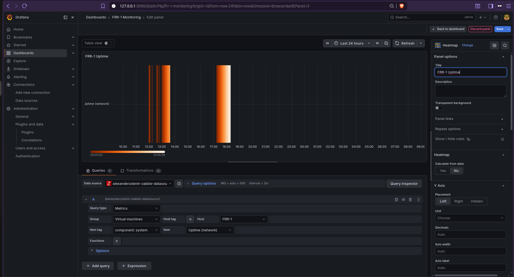

# Phase 3 - Grafana Dashboards

## Overview

In this phase we installed Grafana and connected it to Zabbix as a datasource
using the alexanderzobnin-zabbix-app plugin. We created a dashboard with three
panels to visualize FRR-1 metrics collected by Zabbix.

## Installation

Grafana installed on Ubuntu via official repository: https://grafana.com/docs/grafana/latest/setup-grafana/installation/debian/

Service running on: http://127.0.0.1:3000

Zabbix plugin installed: https://grafana.com/grafana/plugins/alexanderzobnin-zabbix-app/

Datasource configured with:
- URL: http://127.0.0.1/zabbix/api_jsonrpc.php
- Username: Admin

## Dashboard: FRR-1 Monitoring

## Panels

### FRR-1 ICMP Response Time

Type: Time series
Measures the round-trip time of ICMP ping packets from Zabbix to FRR-1.  
Represents network latency in milliseconds — a spike indicates the network  
is slow, a gap indicates the router was unreachable.

### FRR-1 SNMP Availability

Type: Stat
Shows the current SNMP agent availability on FRR-1.
1 = SNMP service running and reachable, 0 = SNMP service down.
Displays the timestamp of the last check.

### FRR-1 Uptime

Type: Heatmap
Measures how long FRR-1 has been running without interruption.
Unlike ICMP response time which measures network speed, uptime resets to
zero every time the container is restarted.   
Orange bars represent periods of continuous activity — gaps indicate reboots or shutdowns.

